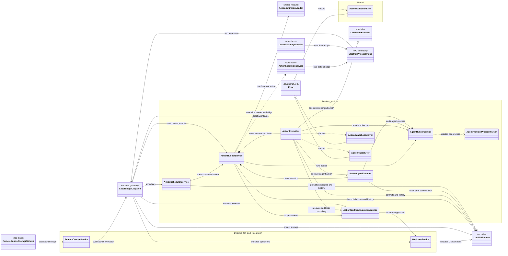

# Class relationships

The diagrams cover every production class declared in `app/src`, `desktop/src`, and `shared`, plus every production React component in `app/src`. The inventory contains 38 app classes, 132 React components, and 12 desktop/shared classes. Test-only declarations, declaration-file duplicates, hooks, and third-party components are excluded. Interfaces, browser/library base classes, and module-level gateways are included only where they clarify a relationship.

## React app classes

```mermaid
classDiagram
    direction LR

    class EventTarget {
        <<browser API>>
    }
    class Error {
        <<JavaScript API>>
    }
    class MenuOption {
        <<Lexical API>>
    }
    class StorageService {
        <<interface>>
    }
    class ElectronDataBridge {
        <<interface>>
    }
    class ElectronActionBridge {
        <<interface>>
    }
    class DesktopHostServices {
        <<desktop boundary>>
    }
    class ActionValidationError {
        <<shared class>>
    }

    namespace App_Core {
        class DataService
        class ProjectState
        class ProjectLoading
        class CardOperations
        class AgentIntegration
        class ReleaseOperations
        class SaveStateService
        class CommitBatcher
    }

    namespace Actions_and_Agents {
        class ActionService
        class ActionExecutionService
        class AgentConversationService
        class AgentCapabilitiesService
        class AgentAcknowledgementService
    }

    namespace Project_and_Global_Services {
        class ProjectSessionService
        class ConfigService
        class WorktreeService
        class WorkspaceViewService
        class WorkspaceNavigationService
        class OpenFilesService
        class GlobalProgressService
        class DialogService
        class TelemetryService
    }

    namespace Storage_Adapters {
        class LocalGitStorageService
        class RemoteControlStorageService
    }

    namespace GitHub {
        class GithubAuthService
        class GithubApiClient
        class GithubUnauthorizedError
        class GithubStorageService
        class GithubStorageContext
        class GithubStorageGitData
        class GithubStorageLoader
        class GithubStorageWriter
        class GithubProjectConfigStorage
        class GithubPendingCommitConflictError
    }

    namespace Editor_and_Search {
        class MarkdownDocumentHistoryStore
        class MarkdownPlaceholderOption
        class InvalidSearchPatternError
        class MissingWorkingFolderError
    }

    namespace React_Root_Components {
        class App
        class AppThemeProvider
        class DialogDisplay
        class GlobalProgressBackdrop
        class GithubAuthPanel
        class ProjectWorkspace
        class RemarkableImportPanel
        class ResizablePopover
        class ResizablePopper
        class SelectableAlertMessage
    }

    namespace React_Agent_Components {
        class AgentChatFab
        class AgentConversationList
        class AgentUsageDisplay
        class ConversationItem
    }

    namespace React_Action_Components {
        class ActionAgentCapabilityFields
        class ActionAgentForm
        class ActionCommitDropdown
        class ActionConversationChat
        class ActionConversationPicker
        class ActionDefinitionFields
        class ActionEditor
        class ActionEditorField
        class ActionEditorTab
        class ActionEntryPoints
        class ActionFilterEditor
        class ActionIcon
        class ActionLinkListEditor
        class ActionOnRulesEditor
        class ActionOrderedCollection
        class ActionOrderedRowActions
        class ActionPhraseButtons
        class ActionPhraseToolbarControls
        class ActionPopup
        class ActionPopupContent
        class ActionRunHistory
        class ActionRunStatus
        class ActionScheduleForm
        class ActionSectionLabel
        class ActionSelector
        class ActionSelectorField
        class ActionUsageSummary
        class CardRunButton
        class CommitReferenceRow
        class DiffFileView
        class DiffView
        class HistoryEntryRow
    }

    namespace React_Card_Components {
        class AffectedFileChip
        class AffectsEditorContent
        class AffectsEditorDialog
        class CardBodyEditor
        class CardBodyPopover
        class CardColumn
        class CardDeleteDialog
        class CardDragOverlay
        class CardPolicyMenuItem
        class CardPopupToolbarControls
        class CardView
        class CardViewNavigation
        class CardWorktreeIndicator
        class ProjectCardView
        class ToolbarContents
    }

    namespace React_Config_Components {
        class AgentProfileForm
        class AgentProfileRow
        class AgentProfilesEditor
        class ConfigPage
        class ConfigSectionLayout
        class ConfigValueEditor
        class DesktopConfigSection
        class MarkdownConfigSection
        class MarkdownSectionEditor
        class MarkdownStylePreview
        class ProjectConfigSection
        class ReactConfigSection
        class WorktreeConfigList
        class WorktreeConfigRow
    }

    namespace React_Editor_Components {
        class MarkdownDocumentHistoryPlugin
        class MarkdownDocumentUndoRedo
        class MarkdownEditor
        class MarkdownFormatToolbarControls
        class MarkdownPlaceholderOptionItem
        class MarkdownPlaceholderToolbarControl
        class MarkdownPlaceholderTypeaheadPlugin
    }

    namespace React_Text_View_Components {
        class BranchIcon
        class CardPropertiesPanel
        class CardPropertiesPopover
        class CreateTreeItemDialog
        class FileTreeNodeRow
        class FileTreeRow
        class FileTreeView
        class ListEditorToolbarControls
        class TabBar
        class TextView
    }

    namespace React_Shell_Components {
        class GithubAuthToolbarButton
        class KeyboardStatus
        class LeftPanelSlot
        class LeftPanelSlotProvider
        class LeftPanelTarget
        class MainWindow
        class ProjectAgentUsageSummary
        class ProjectToolbarMenu
        class RemarkableImportToolbarButton
        class RemoteConnectButton
        class RemoteConnectDialog
        class RemoteControlButton
        class RemoteControlConnectionInfo
        class RemoteControlStatusIndicator
        class RunningAgentsIndicator
        class SearchControl
        class SearchResults
        class SplitLayout
        class StartupSplash
        class StatusBar
        class ThemeControls
        class ThemeSettingsDialog
        class ThemeToggleButton
    }

    namespace React_Menu_Components {
        class AppMenu
        class BranchMenuSelect
        class BranchValue
        class MainToolbar
        class Menu
        class MenuIconButton
        class MenuSelect
        class MobileCreateMenu
        class Section
        class Tab
        class ThemeModeToggle
    }

    namespace React_Project_Dialog_Components {
        class BranchSwitchDialog
        class CompleteReleaseDialog
        class NewCardDialog
        class ProjectFolderSetupForm
        class ProjectOpenDialog
        class WorkingFolderChooserDialog
    }

    EventTarget <|-- DataService
    EventTarget <|-- ActionService
    EventTarget <|-- ActionExecutionService
    EventTarget <|-- AgentConversationService
    EventTarget <|-- AgentCapabilitiesService
    EventTarget <|-- AgentAcknowledgementService
    EventTarget <|-- ProjectSessionService
    EventTarget <|-- ConfigService
    EventTarget <|-- WorktreeService
    EventTarget <|-- WorkspaceViewService
    EventTarget <|-- WorkspaceNavigationService
    EventTarget <|-- OpenFilesService
    EventTarget <|-- GlobalProgressService
    EventTarget <|-- DialogService
    EventTarget <|-- SaveStateService
    EventTarget <|-- GithubAuthService

    Error <|-- GithubUnauthorizedError
    Error <|-- GithubPendingCommitConflictError
    Error <|-- InvalidSearchPatternError
    Error <|-- MissingWorkingFolderError
    Error <|-- ActionValidationError
    MenuOption <|-- MarkdownPlaceholderOption

    DataService *-- ProjectState : owns state
    DataService *-- ProjectLoading : owns loading workflow
    DataService *-- CardOperations : owns card workflow
    DataService *-- AgentIntegration : owns agent integration
    DataService *-- ReleaseOperations : owns release workflow
    DataService *-- SaveStateService : owns save tracking
    DataService *-- CommitBatcher : owns after init
    DataService --> StorageService : active persistence
    DataService --> ActionService : observes and persists drafts
    DataService --> AgentConversationService : reads running agents
    DataService --> ConfigService : resolves project config
    DataService --> WorktreeService : initializes
    DataService --> OpenFilesService : reconciles renamed paths
    DataService --> DialogService : reports load errors
    DataService --> TelemetryService : reports failures

    ProjectLoading --> ActionService : loads action definitions
    ProjectLoading --> ConfigService : loads project config
    ProjectLoading --> WorktreeService : loads worktrees
    ProjectLoading --> GlobalProgressService : reports loading
    ProjectLoading --> DialogService : reports errors
    ProjectLoading --> TelemetryService : captures failures
    CardOperations --> TelemetryService : tracks mutations
    ReleaseOperations --> TelemetryService : tracks releases

    AgentIntegration --> ActionService : resolves actions
    AgentIntegration --> ActionExecutionService : observes executions
    AgentIntegration --> DialogService : reports conversation errors
    AgentIntegration --> TelemetryService : captures failures
    AgentCapabilitiesService --> ConfigService : reads agent profiles
    AgentCapabilitiesService --> ElectronDataBridge : executable availability
    AgentCapabilitiesService --> ElectronActionBridge : remote availability
    ActionExecutionService --> ActionService : labels and action types
    ActionExecutionService --> ElectronActionBridge : start, cancel, subscribe
    ActionService ..> ActionValidationError : handles validation details

    ProjectSessionService --> DataService : opens and switches projects
    ProjectSessionService --> ConfigService : persists project setup
    ProjectSessionService --> DialogService : reports session errors
    ProjectSessionService ..> LocalGitStorageService : selects local storage
    ProjectSessionService ..> RemoteControlStorageService : selects remote storage
    ProjectSessionService ..> GithubStorageService : selects GitHub storage
    ProjectSessionService ..> GithubPendingCommitConflictError : handles conflict
    WorktreeService --> StorageService : loads and saves registrations

    StorageService <|.. LocalGitStorageService
    StorageService <|.. RemoteControlStorageService
    StorageService <|.. GithubStorageService
    ElectronActionBridge <|.. RemoteControlStorageService
    LocalGitStorageService --> ElectronDataBridge : local IPC
    ElectronDataBridge --> DesktopHostServices : invokes
    ElectronActionBridge --> DesktopHostServices : invokes or streams
    RemoteControlStorageService --> DesktopHostServices : WebSocket

    GithubStorageService *-- GithubStorageContext : owns
    GithubStorageService ..> GithubStorageGitData : creates shared helper
    GithubStorageService *-- GithubStorageLoader : owns
    GithubStorageService *-- GithubStorageWriter : owns
    GithubStorageService *-- GithubProjectConfigStorage : owns
    GithubStorageContext *-- GithubApiClient : creates on init
    GithubStorageGitData --> GithubStorageContext
    GithubStorageLoader --> GithubStorageContext
    GithubStorageLoader --> GithubStorageGitData
    GithubStorageLoader ..> MissingWorkingFolderError : throws
    GithubStorageWriter --> GithubStorageContext
    GithubStorageWriter --> GithubStorageGitData
    GithubStorageWriter ..> GithubPendingCommitConflictError : throws
    GithubProjectConfigStorage --> GithubStorageContext
    GithubProjectConfigStorage --> GithubStorageGitData
    GithubProjectConfigStorage --> GithubStorageWriter
    GithubApiClient ..> GithubUnauthorizedError : throws
    GithubAuthService ..> GithubUnauthorizedError : handles

    App --> AppThemeProvider
    App --> DialogDisplay
    App --> MainWindow
    App --> RemoteControlButton
    App --> StartupSplash
    App --> DialogService : reports bootstrap errors
    DialogDisplay --> GlobalProgressBackdrop
    DialogDisplay --> SelectableAlertMessage
    DialogDisplay --> DialogService : observes messages

    MainWindow --> AppMenu
    MainWindow --> ConfigPage
    MainWindow --> GithubAuthToolbarButton
    MainWindow --> LeftPanelSlotProvider
    MainWindow --> LeftPanelTarget
    MainWindow --> ProjectWorkspace
    MainWindow --> SearchControl
    MainWindow --> SplitLayout
    MainWindow --> StatusBar
    MainWindow --> ThemeModeToggle
    ProjectWorkspace --> AgentChatFab
    ProjectWorkspace --> CardView
    ProjectWorkspace --> TextView
    ProjectWorkspace --> WorkspaceNavigationService : observes open requests
    ProjectWorkspace --> WorkspaceViewService : selects view

    AgentChatFab --> ActionPopup
    AgentConversationList --> ConversationItem
    ActionUsageSummary --> AgentUsageDisplay
    ProjectAgentUsageSummary --> AgentUsageDisplay

    ActionEditor --> ActionDefinitionFields
    ActionEditor --> ActionEditorTab
    ActionEditor --> ActionPhraseToolbarControls
    ActionDefinitionFields --> ActionAgentCapabilityFields
    ActionDefinitionFields --> ActionEditorField
    ActionDefinitionFields --> ActionFilterEditor
    ActionDefinitionFields --> ActionLinkListEditor
    ActionDefinitionFields --> ActionOnRulesEditor
    ActionDefinitionFields --> ActionSectionLabel
    ActionAgentCapabilityFields --> ActionEditorField
    ActionAgentCapabilityFields --> ActionSectionLabel
    ActionFilterEditor --> ActionEditorField
    ActionFilterEditor --> ActionSectionLabel
    ActionLinkListEditor --> ActionOrderedCollection
    ActionLinkListEditor --> ActionSelectorField
    ActionOnRulesEditor --> ActionEditorField
    ActionOnRulesEditor --> ActionOrderedCollection
    ActionOnRulesEditor --> ActionSelectorField
    ActionOrderedCollection --> ActionOrderedRowActions
    ActionOrderedCollection --> ActionSectionLabel
    ActionSelectorField --> ActionEditorField
    ActionPhraseToolbarControls --> MarkdownFormatToolbarControls

    ActionEntryPoints --> ActionIcon
    ActionEntryPoints --> ActionPopup
    CardRunButton --> ActionPopup
    ActionPopup --> ActionPopupContent
    ActionPopupContent --> ActionAgentForm
    ActionPopupContent --> ActionConversationChat
    ActionPopupContent --> ActionConversationPicker
    ActionPopupContent --> ActionPhraseButtons
    ActionPopupContent --> ActionRunHistory
    ActionPopupContent --> ActionRunStatus
    ActionPopupContent --> ActionScheduleForm
    ActionPopupContent --> ActionSelector
    ActionPopupContent --> ActionUsageSummary
    ActionPopupContent --> ResizablePopper
    ActionAgentForm --> MarkdownEditor
    ActionRunHistory --> HistoryEntryRow
    HistoryEntryRow --> CommitReferenceRow
    ActionCommitDropdown --> CommitReferenceRow
    CommitReferenceRow --> DiffView
    DiffView --> DiffFileView
    ActionPopup --> ActionExecutionService : reads live execution
    ActionEditor --> ActionService : edits action drafts
    ActionAgentCapabilityFields --> AgentCapabilitiesService : reads capabilities

    CardView --> AffectsEditorDialog
    CardView --> CardBodyPopover
    CardView --> CardColumn
    CardView --> CardDragOverlay
    AffectsEditorDialog --> AffectsEditorContent
    AffectsEditorContent --> AffectedFileChip
    CardColumn --> ProjectCardView
    ProjectCardView --> ActionEntryPoints
    ProjectCardView --> CardDeleteDialog
    ProjectCardView --> CardPolicyMenuItem
    ProjectCardView --> CardRunButton
    ProjectCardView --> CardWorktreeIndicator
    CardBodyPopover --> AgentUsageDisplay
    CardBodyPopover --> CardBodyEditor
    CardBodyPopover --> CardDeleteDialog
    CardBodyPopover --> ResizablePopover
    CardBodyEditor --> CardPopupToolbarControls
    CardBodyEditor --> MarkdownEditor
    CardBodyEditor --> ToolbarContents
    ToolbarContents --> CardPopupToolbarControls
    CardPopupToolbarControls --> MarkdownFormatToolbarControls
    CardView --> DataService : reads and mutates cards

    TextView --> ActionEditor
    TextView --> ActionPopup
    TextView --> AgentConversationList
    TextView --> CardPropertiesPanel
    TextView --> CardPropertiesPopover
    TextView --> FileTreeView
    TextView --> LeftPanelSlot
    TextView --> ListEditorToolbarControls
    TextView --> MarkdownEditor
    TextView --> TabBar
    FileTreeView --> CreateTreeItemDialog
    FileTreeView --> FileTreeNodeRow
    FileTreeView --> FileTreeRow
    FileTreeNodeRow --> ActionEntryPoints
    FileTreeNodeRow --> BranchIcon
    ListEditorToolbarControls --> MarkdownDocumentUndoRedo
    ListEditorToolbarControls --> MarkdownFormatToolbarControls
    TextView --> OpenFilesService : owns open-file tabs

    MarkdownEditor --> MarkdownFormatToolbarControls
    MarkdownEditor ..> MarkdownDocumentHistoryPlugin : realm child
    MarkdownEditor ..> MarkdownPlaceholderTypeaheadPlugin : realm child
    MarkdownFormatToolbarControls --> MarkdownPlaceholderToolbarControl
    MarkdownPlaceholderTypeaheadPlugin --> MarkdownPlaceholderOptionItem
    MarkdownDocumentHistoryPlugin --> MarkdownDocumentHistoryStore : registers editor
    MarkdownPlaceholderOptionItem --> MarkdownPlaceholderOption : renders option

    ConfigPage --> DesktopConfigSection
    ConfigPage --> MarkdownConfigSection
    ConfigPage --> ProjectConfigSection
    ConfigPage --> ReactConfigSection
    DesktopConfigSection --> ConfigSectionLayout
    ProjectConfigSection --> ConfigSectionLayout
    ProjectConfigSection --> WorktreeConfigList
    ReactConfigSection --> ConfigSectionLayout
    ConfigSectionLayout --> ConfigValueEditor
    ConfigValueEditor --> AgentProfilesEditor
    AgentProfilesEditor --> AgentProfileForm
    AgentProfilesEditor --> AgentProfileRow
    MarkdownConfigSection --> MarkdownSectionEditor
    MarkdownConfigSection --> MarkdownStylePreview
    WorktreeConfigList --> WorktreeConfigRow
    ConfigPage --> ConfigService : edits configuration
    WorktreeConfigList --> WorktreeService : edits worktrees

    AppMenu --> ActionEntryPoints
    AppMenu --> BranchMenuSelect
    AppMenu --> BranchSwitchDialog
    AppMenu --> CompleteReleaseDialog
    AppMenu --> GithubAuthToolbarButton
    AppMenu --> MainToolbar
    AppMenu --> Menu
    AppMenu --> MenuIconButton
    AppMenu --> MenuSelect
    AppMenu --> MobileCreateMenu
    AppMenu --> NewCardDialog
    AppMenu --> ProjectOpenDialog
    AppMenu --> Section
    AppMenu --> Tab
    MainToolbar --> ThemeToggleButton
    MobileCreateMenu --> Menu
    BranchMenuSelect --> BranchValue

    ProjectToolbarMenu --> BranchSwitchDialog
    ProjectToolbarMenu --> CompleteReleaseDialog
    ProjectToolbarMenu --> NewCardDialog
    ProjectToolbarMenu --> ProjectOpenDialog
    ProjectOpenDialog --> ProjectFolderSetupForm
    ProjectOpenDialog --> WorkingFolderChooserDialog
    NewCardDialog --> MarkdownEditor
    GithubAuthToolbarButton --> GithubAuthPanel
    GithubAuthToolbarButton --> GithubAuthService : reads auth state
    RemarkableImportToolbarButton --> RemarkableImportPanel
    RemoteConnectButton --> RemoteConnectDialog
    RemoteControlButton --> RemoteConnectButton
    RemoteControlButton --> RemoteControlConnectionInfo
    SearchControl --> ActionPopup
    SearchControl --> SearchResults
    StatusBar --> KeyboardStatus
    StatusBar --> ProjectAgentUsageSummary
    StatusBar --> RemoteControlStatusIndicator
    StatusBar --> RunningAgentsIndicator
    ThemeControls --> ThemeSettingsDialog
    ThemeControls --> ThemeToggleButton
    LeftPanelSlot --> LeftPanelSlotProvider : uses portal context
    BranchSwitchDialog --> ProjectSessionService : switches branch
    CompleteReleaseDialog --> ProjectSessionService : completes release
    NewCardDialog --> ProjectSessionService : creates card
    ProjectOpenDialog --> ProjectSessionService : opens project
```

`DataService` is the main renderer domain aggregate: it owns the project state and workflow classes, while global singleton services communicate through direct imports or `EventTarget`. Persistence is selected per project through `StorageService`. Local Electron, remote-control, and GitHub implementations therefore feed the same app-side workflows. Component arrows show direct rendering, component-as-prop usage, portal/plugin composition, and the principal service dependencies; components without project-defined children remain as leaf nodes.

## Desktop and shared classes



`main.js` composes the desktop service graph. `ActionRunnerService` owns per-run `ActionExecution` instances; `ActionSchedulerService` starts those same executions for timers. `AgentRunnerService` owns child processes and creates a protocol parser for each provider stream. `LocalBridgeDispatch` exposes the graph both to the Electron preload IPC bridge and to `RemoteControlService`, which is how the app-side classes in the first diagram reach the same desktop services.
