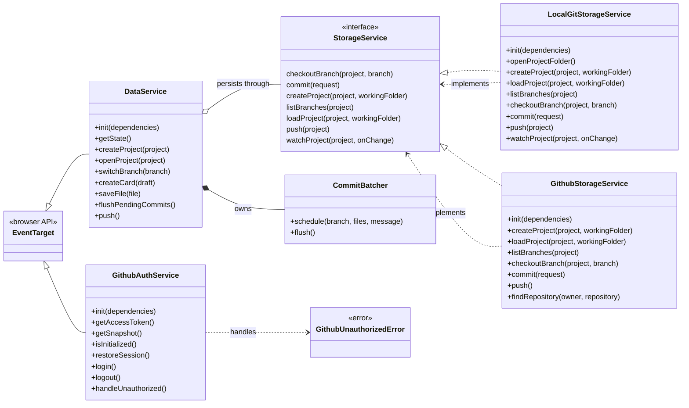

# Class relationships

Current project class usage is concentrated in the React app. The Electron host exposes bridge functions but does not currently define classes.

## Notes

- `DataService` is the project state owner. It creates and owns `CommitBatcher` during `init()`.
- `DataService` persists project changes through the `StorageService` interface, allowing local Git and GitHub-backed implementations.
- `GithubAuthService` is separate from storage. It validates and persists a GitHub personal access token (PAT — the only supported auth method; OAuth/device-flow was removed 2026-07-11) and dispatches auth snapshots through `EventTarget`.
- `GithubUnauthorizedError` is raised by the GitHub user API client and handled by `GithubAuthService`.

