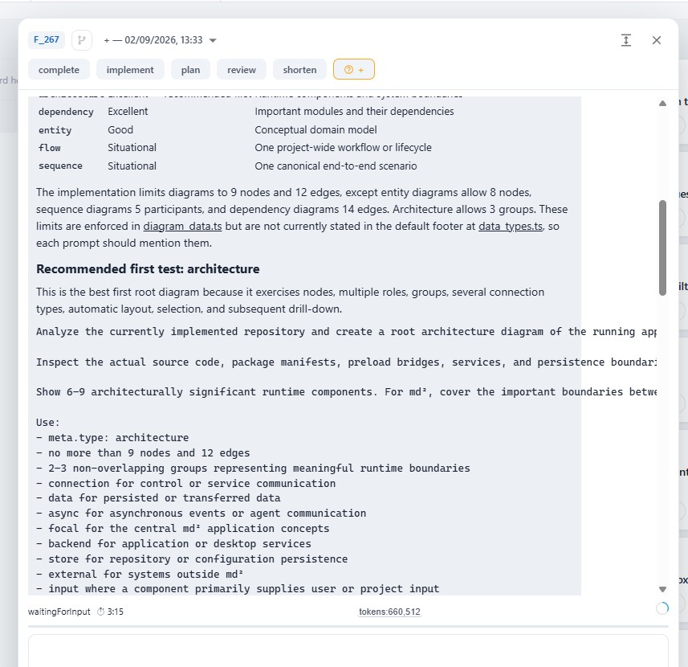

in the action popup's chatlog, we show read only markdown. the formatting of code blocks is terrible: no word-wrap, no clear block. this needs to be improved.

# Current state

* `ActionConversationMessage` (`app/src/components/actions/conversation/action_conversation_message.tsx`) renders user and assistant chat messages with `ReactMarkdown`, `remark-gfm`, and the shared `markdownContentSx`. Both stable history and streaming output reach this component through `ActionConversationGroupList`.
* `buildMarkdownContentSx` (`app/src/components/editor/markdown_style_sx.ts`) gives `<pre>` and its `<code>` child configured code-block typography and spacing, but no block surface, padding, border, or wrapping. Browser `white-space: pre` therefore keeps each source line unwrapped.
* Message balloons are limited to 88% width and can shrink. `ActionConversationTranscript` hides horizontal overflow, so a long code line extends past its balloon and is clipped instead of wrapping. The balloon's `overflowWrap: anywhere` does not override `<pre>` whitespace behavior.
* `markdownContentSx` also styles `MarkdownEditor` and the Markdown-style preview. Those callers do not need changed code-block layout for this feature.

# Implementation details

* Define **block code** as Markdown rendered as `<pre><code>`, including fenced and indented code. Define a **clear block** as code with its own background, divider border, rounded corners, and internal padding, visibly separate from the surrounding message balloon.
* Add chat-specific `<pre>` styles in `ActionConversationMessage`, after `markdownContentSx`, instead of changing the shared style builder. Use theme roles and spacing: `background.paper`, `divider`, theme border radius, and spacing-scale padding. Keep configured code-block font, size, line height, color, and margins.
* Constrain `<pre>` to the message width with border-box sizing. Use `white-space: pre-wrap` to preserve source line breaks and indentation while allowing wrapping, plus `overflow-wrap: anywhere` so an unbroken path, URL, or token can break before it leaves the block. Do not add horizontal scrolling.
* Keep inline code outside `<pre>` unchanged. Preserve Markdown parsing, GFM support, link handling, message width and role colors, transcript ordering, streaming updates, and scroll-stickiness.
* Add focused coverage in `action_conversation_chat.grouped.test.tsx` using the real Markdown renderer. Verify block structure and wrapping styles, theme-based visual separation, long unbroken content containment, and unchanged inline-code behavior.

# Acceptance criteria

* Block code in user and assistant messages has a distinct background, one divider border, rounded corners, and internal padding in light and dark themes.
* Long code lines wrap within the message balloon. Long unbroken paths, URLs, and tokens may break anywhere when needed; they are not clipped and do not create horizontal chat scrolling.
* Existing line breaks, indentation, and consecutive spaces remain visible after wrapping.
* Configured code-block typography and vertical margins still apply.
* Inline code keeps its existing inline appearance and does not receive the block background, border, or padding.
* Historical and currently streaming messages use the same block-code presentation.
* Editable/read-only `MarkdownEditor`, Markdown-style preview, GFM parsing, links, message sizing, and transcript scroll behavior remain unchanged.
* Focused conversation rendering tests pass.
